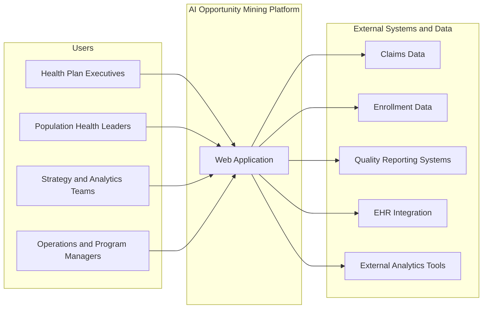
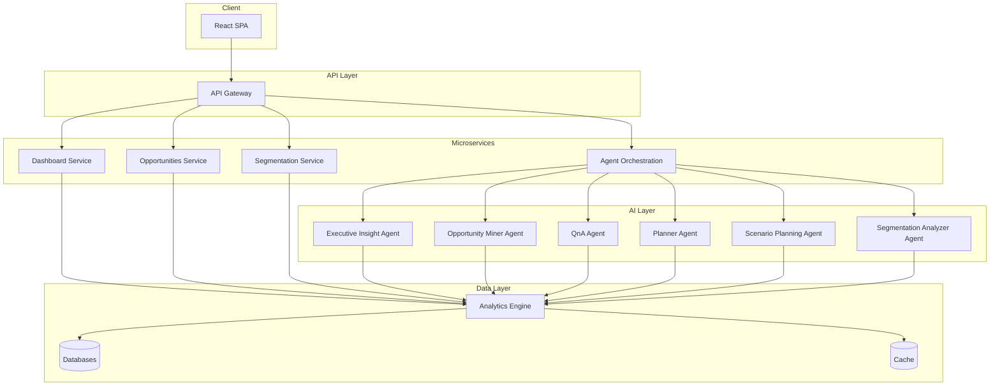
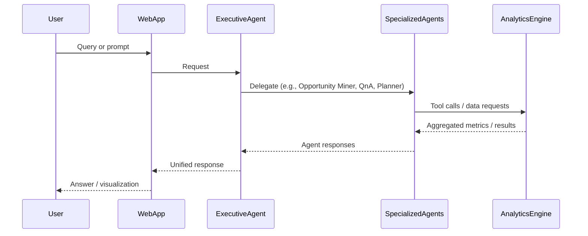
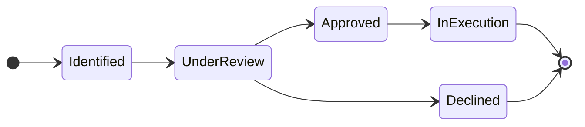
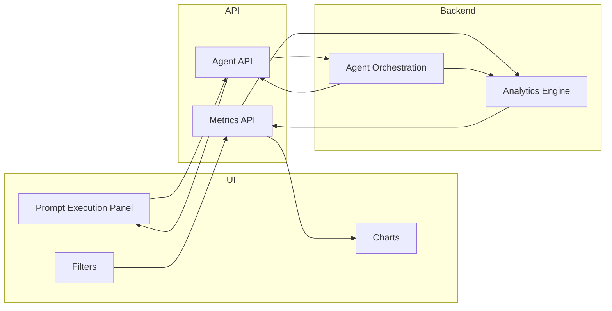

# Software Specification Document
## Agentic AI Opportunity Mining Platform for US Healthcare Payers

**Version:** 1.0  
**Source:** [BRD.md](../BRD.md) (Product Requirements Document)  
**Status:** Draft

---

## 1. Introduction

### 1.1 Purpose

This Software Specification Document (SSD) defines the technical design, architecture, data models, APIs, and module specifications for the **Agentic AI Opportunity Mining Platform**. It serves as the single source of technical truth for development, handoff, and compliance with the product vision described in the BRD.

### 1.2 Scope

The scope covers:

- System context and architecture
- All core modules: Executive Dashboard, Opportunities Management, AI Segmentation, Agentic AI Layer, Data & Analytics Engine
- Data models and API design
- Non-functional requirements (security, performance, scalability)
- Integration points and UX/design principles

Out of scope: Detailed UI mockups, vendor-specific LLM configuration, and operational runbooks.

### 1.3 Definitions

| Term | Definition |
|------|------------|
| **LOB** | Line of Business (e.g., Medicare, Medicaid, Commercial) |
| **MLR** | Medical Loss Ratio |
| **PMPM** | Per Member Per Month (cost/revenue) |
| **Agentic AI** | Multi-agent system where LLM-powered agents use tools and orchestration to perform tasks |
| **Opportunity** | A margin-improvement opportunity identified by the platform (with confidence, savings, complexity, status) |
| **Segment** | An AI-generated population segment with risk/cost characteristics |

### 1.4 References

- **BRD:** [BRD.md](../BRD.md) — Product Requirements Document (PRD) for the AI Opportunity Mining Platform
- Target users: Health plan executives (CEO, CFO, COO), population health leaders, strategy/analytics teams, value-based care leaders, operations and program managers

---

## 2. System Context

The platform sits between payer users and multiple data/integration sources. The following diagram illustrates the system context.

**Actors:**

- **Health plan executives** — Primary consumers of executive dashboard and high-level summaries
- **Population health leaders** — Heavy users of AI Segmentation and segment-level opportunity discovery
- **Strategy and analytics teams** — Use Opportunities Management, scenario planning, and exports
- **Value-based care leaders** — Provider and population prompts, segment analytics
- **Operations and program managers** — Opportunity pipeline, approval workflow, execution metrics

**External systems:**

- Claims data (ingestion pipeline)
- Enrollment data
- Quality reporting systems
- EHR integration
- External analytics tools

---

## 3. Architecture

### 3.1 Technology Stack

| Layer | Technology |
|-------|------------|
| **Frontend** | React (TypeScript), Redux / React Query, D3 / Recharts |
| **Backend** | Node.js and/or Python microservices |
| **AI Layer** | Multi-agent architecture (LLM + tools) |
| **Data Layer** | Healthcare claims, enrollment, quality, utilization datasets |
| **Deployment** | Cloud-native (Azure or AWS), HIPAA-compliant |

### 3.2 High-Level Architecture

### 3.3 Multi-Agent Workflow

Request flow follows the BRD: User → Executive Agent → Specialized Agents → Analytics Engine → Response.

### 3.4 Deployment Model

- **Environments:** Dev, Staging, Production (HIPAA-compliant)
- **Cloud:** Azure or AWS with BAA in place
- **Scaling:** Horizontal scaling of API and AI services; multi-tenant architecture for multiple payer organizations

---

## 4. Module Specifications

### 4.1 Executive Dashboard

**Overview:** High-level executive command center combining metrics visualization and an AI-powered interactive prompt library.

**Inputs:**

- Filter selections: LOB, time period, geography, population segment
- User-initiated prompt execution (from pre-packaged library)
- Data from Analytics Engine (org, opportunity, cost/utilization, trend metrics)

**Outputs:**

- Rendered dashboard: KPI cards, charts (D3/Recharts), drill-down views
- Prompt execution results (AI-generated narrative and/or charts)
- Export artifacts (PPT/PDF)

**Behaviors:**

| Area | Specification |
|------|----------------|
| **Organizational metrics** | Total members, total revenue, total medical cost, MLR, PMPM |
| **Opportunity metrics** | Total identified opportunities, total potential savings, active opportunities, approved opportunities |
| **Cost & utilization metrics** | Inpatient admission rate, ER utilization, outpatient utilization, pharmacy cost trends |
| **Trend analytics** | Rolling 12-month MLR trend, rolling 12-month PMPM trend, predictive forecasts |
| **Filters** | LOB, time period, geography, population segment — applied to all metrics and prompts |
| **Prompt library** | Embedded prompts; execution panel invokes Executive/Insight agent (or specialized agent); results shown in chat overlay or inline panel |
| **Export** | Export current view or report to PPT/PDF (library + backend support) |

**Functional requirements (from BRD):** Interactive drill-down dashboard, dynamic chart rendering, AI chat overlay, prompt execution panel, export to PPT/PDF.

---

### 4.2 Opportunities Management

**Overview:** Centralized opportunity management workspace powered by AI (review, what-if, QnA, approval, modification, creation).

**Inputs:**

- List of opportunities from Opportunity Miner Agent and/or manual/Planner-created entries
- User actions: approve/decline, edit (text-based AI), re-run mining, search/filter
- User questions to QnA Agent (assumptions, ROI, risks)
- What-if prompt and parameters for scenario simulation

**Outputs:**

- Opportunity list/dashboard (confidence score, estimated savings, implementation complexity, status)
- Explainability view and supporting analytics per opportunity
- What-if financial projections
- QnA answers in chat
- Updated status and audit log entries

**Behaviors:**

| Feature | Specification |
|---------|----------------|
| **Opportunity entity** | Attributes: title, description, confidence score, estimated savings, implementation complexity, status (e.g., identified, under review, approved, declined, in execution), tags, version, created/updated timestamps |
| **Opportunity review** | Explainability view, supporting analytics, AI-generated rationale |
| **What-if scenario** | Interactive prompt-driven simulations; financial projections returned by Scenario/analytics services |
| **QnA Agent** | Context = selected opportunity; users ask about assumptions, expected ROI, risks, dependencies |
| **Approval workflow** | Approve/decline actions; status transitions; full audit log |
| **Modification** | Text-based AI editing of opportunity fields; option to re-run opportunity mining |
| **Creation** | Planner agent chat interface; guided opportunity generation; new opportunity persisted with initial status |
| **Lifecycle** | Tracking from identification to approval/execution; version history; tagging and categorization; search and filtering; collaboration notes |

**Functional requirements (from BRD):** Opportunity lifecycle tracking, version history, tagging and categorization, search and filtering, collaboration notes.

---

### 4.3 AI Segmentation

**Overview:** Population analytics and AI-driven segmentation workspace (metrics, segments, explainability, QnA, opportunity discovery).

**Inputs:**

- Population and utilization data from Data & Analytics Engine
- User selection: segment(s), filters (e.g., LOB, time)
- User questions to Segment QnA Agent
- Predefined prompt: “Analyze relevant opportunities for selected segment”

**Outputs:**

- Population metrics dashboard (total members, risk distribution, cost distribution, utilization patterns)
- AI-generated segment list with profiles, risk characteristics, cost drivers, intervention opportunities
- Segment explainability (why segment exists, key features, behavioral patterns)
- QnA answers (risk drivers, cost levers, care gaps)
- Opportunity discovery results for selected segment(s)

**Behaviors:**

| Area | Specification |
|------|----------------|
| **Population metrics** | Total members, risk distribution, cost distribution, utilization patterns |
| **AI-generated segments** | Segment profiles, risk characteristics, cost drivers, intervention opportunities |
| **Segment explainability** | Why segment exists, key features, behavioral patterns (Segmentation Analyzer Agent) |
| **Segment QnA** | Interactive queries about risk drivers, cost levers, care gaps |
| **Opportunity discovery** | Predefined prompt: analyze relevant opportunities for selected segment; results tied to Opportunities Management |
| **Visualization** | Segment visualization, cluster comparison, trend tracking, export reports |

**Functional requirements (from BRD):** Segment visualization, cluster comparison, trend tracking, export reports.

---

### 4.4 Agentic AI Layer

**Overview:** Multi-agent system that orchestrates specialized agents, tool use, memory, explainability, confidence scoring, and scenario simulation.

**Agents (from BRD):**

| Agent | Primary role |
|-------|----------------------|
| **Executive Insight Agent** | Entry point for dashboard prompts; routes to other agents; synthesizes responses |
| **Opportunity Miner Agent** | Identifies and ranks margin improvement opportunities; supports re-run mining |
| **QnA Agent** | Answers questions in context (opportunity or segment); assumptions, ROI, risks |
| **Planner Agent** | Guided opportunity creation via chat |
| **Scenario Planning Agent** | What-if simulations, financial projections |
| **Segmentation Analyzer Agent** | Segment explainability; segment-level analytics and opportunity discovery |

**Capabilities:**

- **Tool usage:** Agents call Analytics Engine and other services (metrics, opportunities, segments, simulations)
- **Memory retention:** Session and/or persistent context for conversation and selected opportunity/segment
- **Explainability:** Rationale and key drivers exposed in UI (e.g., opportunity review, segment explainability)
- **Confidence scoring:** Per-opportunity or per-answer confidence where applicable
- **Scenario simulation:** Invoked by Scenario Planning Agent and what-if flows

**Inputs/Outputs:** User message or prompt → Executive Agent → specialized agent(s) → tool calls → Analytics Engine → structured + natural language response → user.

---

### 4.5 Data & Analytics Engine

**Overview:** Central data and analytics layer consumed by the dashboard, opportunities, segmentation, and all agents.

**Data domains (from BRD):**

- Healthcare claims
- Enrollment
- Quality
- Utilization

**Behaviors:**

- **Metrics aggregation:** Org, opportunity, cost/utilization, trend metrics (e.g., MLR, PMPM, rolling 12-month, forecasts)
- **Opportunity data:** Source data and aggregates supporting opportunity list, explainability, and versioning
- **Segment data:** Population and segment-level aggregates for Segmentation page and Segmentation Analyzer Agent
- **Simulation support:** Data and models for what-if and scenario planning
- **Performance:** Queries optimized to support dashboard load &lt; 3s and AI tool response within overall AI response &lt; 5s target

---

## 5. Data Model and APIs

### 5.1 Core Entities

**Member (reference):** Represents enrolled member; links to enrollment, claims, quality; used for segmentation and population metrics. (Attributes depend on data source; minimal set: member id, LOB, geography, segment refs, key cost/utilization fields.)

**Opportunity:**

- `id`, `title`, `description`, `confidenceScore`, `estimatedSavings`, `implementationComplexity`, `status`, `tags[]`, `version`, `createdAt`, `updatedAt`, `createdBy`, `segmentId` (optional), `rationale` (AI-generated), `supportingAnalytics` (ref or payload)

**Segment:**

- `id`, `name`, `profile` (risk/cost drivers, behavioral patterns), `memberCount`, `metrics` (risk distribution, cost distribution, utilization), `interventionOpportunities[]`, `createdAt`

**AgentSession:**

- `id`, `userId`, `contextType` (e.g., dashboard, opportunity, segment), `contextId`, `messages[]`, `createdAt`, `updatedAt`

**AuditLog:**

- `id`, `entityType`, `entityId`, `action`, `userId`, `timestamp`, `payload` (e.g., status change, approval/decline)

### 5.2 Key API Groups

| API group | Purpose |
|-----------|---------|
| **Dashboard** | Metrics (org, opportunity, cost/utilization, trend); filter dimensions (LOB, time, geography, segment); prompt execution (trigger agent, return result) |
| **Opportunities** | CRUD opportunities; list with filters/search; status transitions (approve/decline); version history; collaboration notes; what-if simulation trigger |
| **Segments** | List segments; segment detail and explainability; population metrics; opportunity discovery for segment |
| **Agents** | Chat send/receive; session create/resume; optional streaming |
| **Auth/Admin** | Login, RBAC, audit log read (and write by system) |

---

## 6. Non-Functional Requirements

| NFR | Specification |
|-----|----------------|
| **Security & compliance** | HIPAA compliance; role-based access control (RBAC); audit logging for sensitive actions; encryption in transit and at rest |
| **Performance** | Dashboard load &lt; 3 seconds; AI response &lt; 5 seconds (end-to-end for typical prompts) |
| **Scalability** | Multi-tenant architecture; horizontal scaling of API and AI services; stateless design where possible |

---

## 7. Integration

| Integration | Direction | Notes |
|-------------|-----------|--------|
| **Claims data ingestion** | Into platform | Pipeline and APIs to ingest and normalize claims for analytics and opportunity mining |
| **EHR** | Bidirectional or inbound | Per BRD; contract and auth as per enterprise integration requirements |
| **Quality reporting systems** | Inbound | Quality measures and gaps feeding dashboard and agents |
| **External analytics tools** | Outbound or inbound | API contracts and security (auth, rate limits, data handling) |

**Authentication:** SSO/identity provider integration; API authentication (e.g., OAuth2 / API keys) for server-to-server and SPA.

---

## 8. UX and Design

- **Executive-friendly interface:** Clear hierarchy, minimal clutter, key metrics upfront
- **Minimal cognitive load:** Progressive disclosure (drill-down, expandable panels); consistent patterns
- **Conversational AI-first experience:** Chat overlay and prompt execution panel central to dashboard and opportunity/segment flows
- **Visual storytelling dashboards:** Charts (D3/Recharts) for trends and comparisons; consistent color and legend
- **Accessibility and responsiveness:** WCAG considerations; responsive layout for different screen sizes

---

## 9. Diagrams Reference

### 9.1 Opportunity Lifecycle and Approval Workflow

### 9.2 Data Flow: Dashboard Metrics and Prompt Execution

---

*End of Software Specification Document.*
